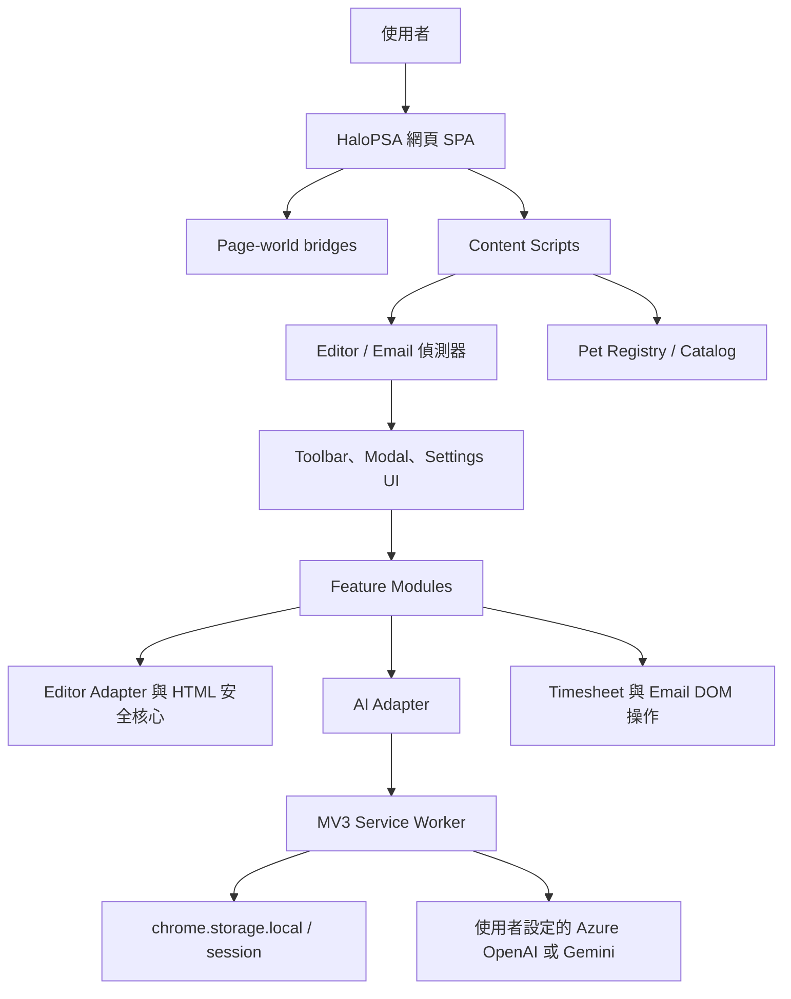
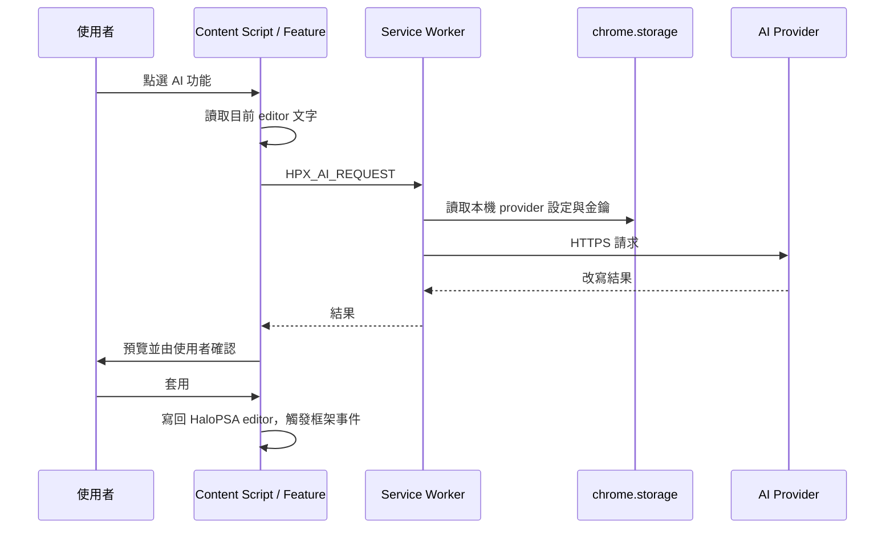

# HaloPSA Writing Helper

以 Manifest V3 實作的瀏覽器擴充功能，為 HaloPSA 頁面的文字編輯、Activity Note、Timesheet 與寄信流程提供輔助工具。專案採無建置步驟的原生 JavaScript 架構，可直接以 Chrome 的「載入未封裝項目」安裝。

> 專案不內建公司租戶網址、聯絡人、Ticket 資料或 API 金鑰。可識別資料與金鑰只應存在於使用者本機瀏覽器的設定中。

## 解決的問題

HaloPSA 是單頁應用程式，編輯器與視窗會動態掛載及卸載。本擴充功能以集中化 DOM selector、編輯器轉接層與 MutationObserver 偵測，讓使用者在既有頁面流程中完成格式整理、AI 改寫、範本插入、Note 編輯、Timesheet 輔助與 CC 名單管理。

## 主要功能

- AI 文字改寫與中英文翻譯；背景 Service Worker 呼叫使用者自行設定的 AI provider。
- 可預覽後再套用的格式整理與常用文字範本。
- 獨立 Activity Note 編輯視窗，支援 HTML 清理、圖片 placeholder 與寫回前人工確認。
- Timesheet 對齊與 Time Taken 快速調整。
- 寄信視窗的 CC 聯絡人群組工具列；名單只保存在本機瀏覽器。
- 主題、外觀與可選擇的 Codex Pet 動畫。

## 系統架構



Content script 的載入順序定義在 `manifest.json`，且是執行期依賴圖：所有模組以 IIFE 掛載到 `window.__HPX` 命名空間，再由 `src/content.js` 啟動。

更完整的模組責任、訊息契約與資料流請見 [架構文件](docs/ARCHITECTURE.md)。

## Extension 執行流程

1. Manifest 將 page-world bridge 與 content scripts 注入符合通用 HaloPSA 網域規則的頁面。
2. `namespace.js` 建立 `window.__HPX`；設定、核心、UI 與 feature 模組依 Manifest 順序註冊。
3. `content.js` 啟動主題、設定面板、編輯器／寄信視窗偵測器與 Timesheet 功能。
4. 使用者操作工具列後，feature 模組透過 Editor Adapter 讀寫頁面內容；需要人工確認的輸出會先開啟預覽。
5. AI 請求只經 `chrome.runtime` 傳給背景 Service Worker；Service Worker 從本機設定讀取金鑰並呼叫 provider。
6. Activity Note 以 `chrome.storage.session` 暫存單一編輯 session，使用者確認套用時才寫回原 HaloPSA 編輯器；最後仍由使用者在 HaloPSA 執行儲存。

## 專案目錄

```text
manifest.json              # MV3 入口、權限與 content-script 載入順序
src/
  content.js               # 頁面啟動與各偵測器協調
  background/              # Service Worker、AI 與 Note session 訊息處理
  page/                    # page-world bridge
  core/                    # namespace、editor adapter、HTML 安全與偵測器
  config/                  # 集中 selector、範本、AI action、功能設定
  features/                # AI、格式、Note、Timesheet、CC 名單功能
  ui/                      # Toolbar、Modal、Theme、設定面板與 Pet 動畫
  editor-window/           # 獨立 Note 編輯視窗
  options/                 # 擴充功能設定頁
  pets/                    # Pet catalog
  styles/                  # 注入頁面的樣式
  ai/                      # AI adapter 與共用 prompt templates
assets/                    # Extension icon 與 Pet 素材
tests/                     # Node.js 單元／純度測試
tools/package.ps1          # 建立可載入的發行封裝
docs/ARCHITECTURE.md       # 架構與資料流文件
```

## 核心模組

| 區域 | 主要責任 |
| --- | --- |
| `src/core` | 建立共享命名空間、尋找 HaloPSA 編輯器、統一讀寫 editor、清理與比對 HTML。 |
| `src/features` | 將 UI 動作轉成可測試的業務功能，例如 AI 改寫、Timesheet、Note 與 CC 名單。 |
| `src/background/service-worker.js` | 保留 API 金鑰於 extension 背景邊界、發送 AI 請求、管理 Note session 與視窗。 |
| `src/config` | 集中 HaloPSA selector 與可調整規則／範本，避免散落在 UI 程式。 |
| `src/ui` | 動態掛載按鈕、呈現結果與設定。 |

## Data Flow



## HaloPSA Integration

- Manifest 使用通用 HaloPSA 相關網域規則，不包含特定公司租戶網址。
- `src/config/selectors.js` 與 `src/config/besties-config.js` 是 DOM 整合的主要調整點。
- HaloPSA 為 SPA，偵測器需處理元件重繪、重複掛載與卸載。
- Extension 只協助填入或整理現有 editor，不直接替使用者儲存 HaloPSA 的 Ticket／Note。

## 安裝方式

1. 下載或 clone 本 repository。
2. 在 Chrome 開啟 `chrome://extensions`，啟用「開發人員模式」。
3. 選擇「載入未封裝項目」，指定本專案根目錄。
4. 從 Extension 選單開啟設定頁，依需要設定 AI provider、金鑰與其他本機選項。

## 開發方式

本專案沒有 Node 套件或 bundler 依賴；以支援 Manifest V3 的 Chrome 與 Node.js 即可進行基本驗證。

```powershell
# JavaScript 語法檢查
Get-ChildItem src, tests -Recurse -Filter *.js | ForEach-Object { node --check $_.FullName }

# 執行測試
Get-ChildItem tests -Filter *.test.js | ForEach-Object { node $_.FullName }

# 建立本機發行封裝（輸出到被 Git 忽略的 dist/）
.\tools\package.ps1
```

修改 content script 模組時，請同步檢查 `manifest.json` 的載入順序與所有路徑；此順序是 runtime dependency graph。

## Configuration

設定頁使用 `chrome.storage.local` 的 `hpx_settings` 物件，採合併寫入以避免 AI、外觀與 CC 名單互相覆蓋。Activity Note 的暫存內容使用 `chrome.storage.session`，在 session 結束後移除。

### Environment Variables

目前沒有使用環境變數，也不提供 `.env` 作為 Extension 執行時設定。AI Endpoint、Deployment、模型與 API 金鑰由每位使用者在設定頁輸入，僅儲存在該瀏覽器的 extension storage，且只由背景 Service Worker 使用。

## 使用方式

開啟符合權限規則的 HaloPSA 頁面後，Extension 會在支援的編輯器、寄信視窗或 Timesheet 流程中動態顯示工具。AI 與格式功能都會先提供可確認的結果；Note 編輯視窗的「套用」只寫回頁面，仍須使用 HaloPSA 原本的儲存操作完成提交。

## Security Notes

- 不要將 API 金鑰、token、匯出的瀏覽器資料、HAR、日誌、截圖、真實 Ticket 或客戶資料加入 repository。
- 不要在 source code、範本、測試 fixture 或文件中放入公司租戶網址、聯絡人或內部流程資料。
- API 金鑰不可由 content script 存取；AI 呼叫必須維持在背景 Service Worker 邊界。
- `.gitignore` 已排除本機設定、憑證、產物、評測資料與內部交接／證據文件；請在每次提交前檢查 staged diff。
- 如需新增範例資料，請使用不可識別的假資料。

## 專案狀態

目前為可載入的 Manifest V3 擴充功能。HaloPSA DOM 結構可能隨產品版本變更，更新 selector 或頁面整合後，仍應在目標環境進行人工驗證。
