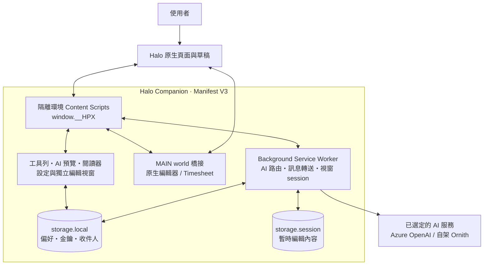

<div align="center">
  <picture>
    <source media="(prefers-reduced-motion: reduce)" srcset="docs/assets/hero-static.svg">
    
  </picture>

  <h1>Halo Companion</h1>
  <p><strong>把撰寫、閱讀與工時操作，收進一個熟悉的工作台。</strong></p>
  <p>HaloPSA Assistant · 原生頁面整合 · AI 草稿預覽 · 本機偏好</p>

  <a href="https://github.com/tigerhzu/halo-psa-extension/releases/latest"></a>
  
  
  

  <p><a href="#安裝與更新">開始使用</a> · <a href="docs/ARCHITECTURE.md">架構與資料流</a> · <a href="docs/TOOLKIT.md">三工具架構全景</a> · <a href="docs/DEVELOPMENT.md">開發指南</a> · <a href="docs/CHANGELOG.md">更新紀錄</a></p>
</div>

## 在 Halo 裡完成工作

Halo Companion 是 Chrome／Edge 的 Manifest V3 擴充功能。它在 HaloPSA 原生頁面上加入工具列、獨立撰寫視窗、工單閱讀器與工時快捷控制，讓常用操作更容易找到。專案也包含個人主題、快捷連結、寵物和可逆的簡單模式。

| 工作情境 | Companion 提供的協助 |
| --- | --- |
| 撰寫回覆 | 回覆客戶、工單分析、First Contact、中英翻譯；原文與可編輯 AI 草稿並排，確認後套用。 |
| 重複輸入 | 範本插入游標位置，聯絡人群組、預設 CC 與地址去重。 |
| 長篇筆記 | 獨立編輯視窗、格式工具、圖片與表格處理；寫回前檢查來源編輯器與內容衝突。 |
| 閱讀工單 | 完整活動歷程的唯讀快照，支援搜尋、類型篩選、排序、收合、縮放及列印。 |
| 調整工時 | Time Taken 快速加減、重設與分鐘輸入；Timesheet 可明確套用新的時間範圍。 |
| 整理工作台 | Team 顯示與排序、簡單模式、主題色、快捷入口及寵物開關。 |
| 換一台電腦 | JSON 設定匯出／匯入，可選含金鑰或不含金鑰。 |

**操作邊界：**AI、範本和獨立編輯視窗套用到 Halo 草稿；工單的儲存或送出仍由使用者執行。Time Taken 修改原生輸入欄位。Timesheet 的「套用」則會呼叫 Halo 原生更新流程，可能直接保存該筆工時，使用前請確認時間範圍。

## 安裝與更新

1. 前往 [最新 Release](https://github.com/tigerhzu/halo-psa-extension/releases/latest)，下載 `halo-psa-extension-1.1.2.zip` 並解壓縮。
2. 在 Chrome 開啟 `chrome://extensions`，或在 Edge 開啟 `edge://extensions`，啟用「開發人員模式」。
3. 選擇「載入未封裝項目」，指定含有 `manifest.json` 的資料夾。
4. 重新整理 Halo 頁面，點擊擴充功能圖示開啟設定中心。初始導覽中的每個步驟都可以略過。

Manifest 的最低 Chromium 版本為 **122**。頁面整合範圍為 Halo 的 `halopsa.com`、`haloitsm.com`、`halocrm.com` 與 `haloservicedesk.com` 子網域。使用自訂 Halo 網域時，需要在本機調整 manifest 的頁面匹配範圍。

更新既有安裝時，先匯出設定備份，再以新版檔案更新原本的安裝資料夾；在擴充功能管理頁按「重新載入」，最後重新整理 Halo。保留同一安裝資料夾及擴充功能 ID，有助沿用該安裝的本機設定。

### AI 設定

- **Azure OpenAI：**填入 Azure Endpoint、Deployment Name 與 API Key。
- **自架 Ornith：**公開版本使用不可連線的示例網域。只有要啟用自架 AI 時，先在解壓後的擴充功能資料夾執行下列命令，再重新載入擴充功能，並在設定頁填入回傳的 Base URL、模型與 API Key。

```powershell
.\scripts\Configure-Ornith.ps1 -Origin 'https://ai.example.com'
```

請將示例換成自己的 HTTPS 主機；參數使用預設 443 埠，且不包含 `/v1` 路徑。腳本只把 manifest 中的 Ornith 權限替換為該單一主機，不存取瀏覽器設定或金鑰。詳細限制見 [自架 AI 設定](docs/DEVELOPMENT.md#自架-ornith)。

Azure 與 Ornith 金鑰互斥；一次使用一個服務。未設定有效服務金鑰時，AI 功能顯示清楚標示的示意內容，可先體驗預覽流程。

## 架構一覽



專案使用 **Vanilla JavaScript、HTML、CSS 與 Chrome Extension APIs**，執行時不需要前端框架或打包器。一般 content script 透過 `window.__HPX` 共用介面，manifest 中的載入順序就是模組依賴順序；背景服務則以 `importScripts()` 載入 AI 設定、prompt 與輸出驗證模組。

原生編輯器橋接辨識頁面上的 Froala、CKEditor、TinyMCE 或可用的原生控制項，Timesheet 橋接則使用 Halo 頁面上的更新入口。這些整合依賴 Halo 實際 DOM 與元件行為，需搭配 SPA 偵測與實機回歸。更多細節見 [完整架構](docs/ARCHITECTURE.md)。

## 資料存放與套用流程

設定、主題、快捷連結、收件人與 API Key 保存在該擴充功能的 `chrome.storage.local`。獨立編輯工作階段使用 `chrome.storage.session`，不把暫時的工單內容寫進本機設定備份。

AI 呼叫從背景服務送至已選定的服務，內容包含使用者要求處理的文字；圖片先轉成遮罩，再於套用時還原。截斷、空白或不符輸出規則的結果會被拒絕。通過驗證的草稿仍需使用者確認才寫回。

設定中心提供完整備份與不含 API Key 的備份。不含金鑰的匯入會保留現有本機金鑰，並在 provider 衝突時阻擋寫入。**不含 API Key 仍可能包含收件人、網址等個人設定**，公開分享前請先檢查檔案內容。

## 開發與驗證

```text
node scripts/verify-manifest.js
node --test tests/*.test.js
node tests/preview-server.js
```

預覽服務只監聽 `http://127.0.0.1:4173`，使用獨立的示範瀏覽器 API，不會寫入正式 Halo 或呼叫真實 AI。測試與預覽檔不放入安裝 ZIP。

程式路徑、瀏覽器回歸頁、測試限制與發佈步驟分別記錄於 [開發指南](docs/DEVELOPMENT.md) 和 [發佈指南](docs/RELEASE.md)。

## Tiger 工具系列

<table>
  <tr><th>工具</th><th>專注的工作</th></tr>
  <tr><td><a href="https://github.com/tigerhzu/freedom-wiki-assistant">Wiki Studio</a></td><td>知識文件與 Wiki 操作輔助</td></tr>
  <tr><td> <strong>Halo Companion</strong></td><td>工單、撰寫與工時工作台</td></tr>
  <tr><td><a href="https://github.com/tigerhzu/clarity-clipboard">Clarity Clipboard</a></td><td>桌面剪貼簿整理與重複使用</td></tr>
</table>

此專案為獨立輔助工具。HaloPSA、Azure OpenAI 與相關產品名稱屬於各自的權利人。

## 設計素材

[Logo SVG](docs/assets/logo.svg) · [Logo PNG](docs/assets/logo.png) · [動態封面](docs/assets/hero.svg) · [靜態封面](docs/assets/hero-static.svg) · [架構圖 SVG](docs/assets/architecture.svg)。原始圖形與配色資料一起收錄在 Release 的品牌素材包；首頁動畫尊重減少動態效果偏好。
