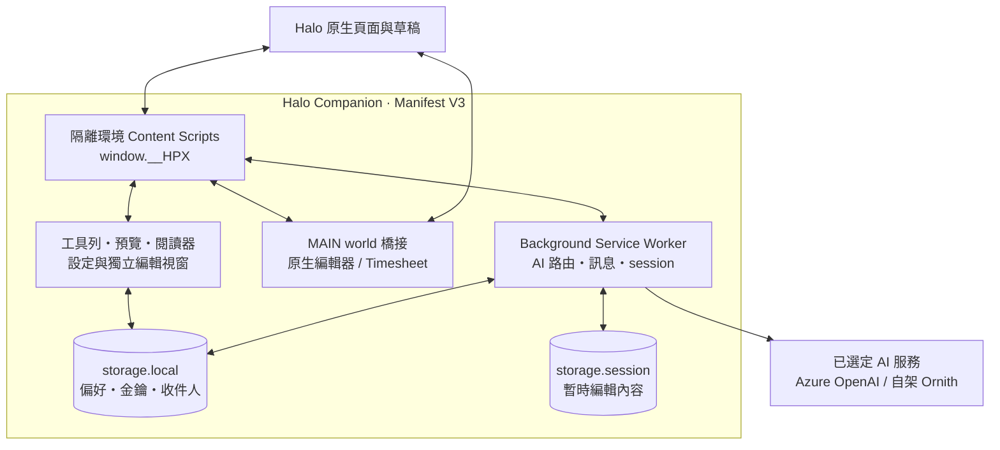
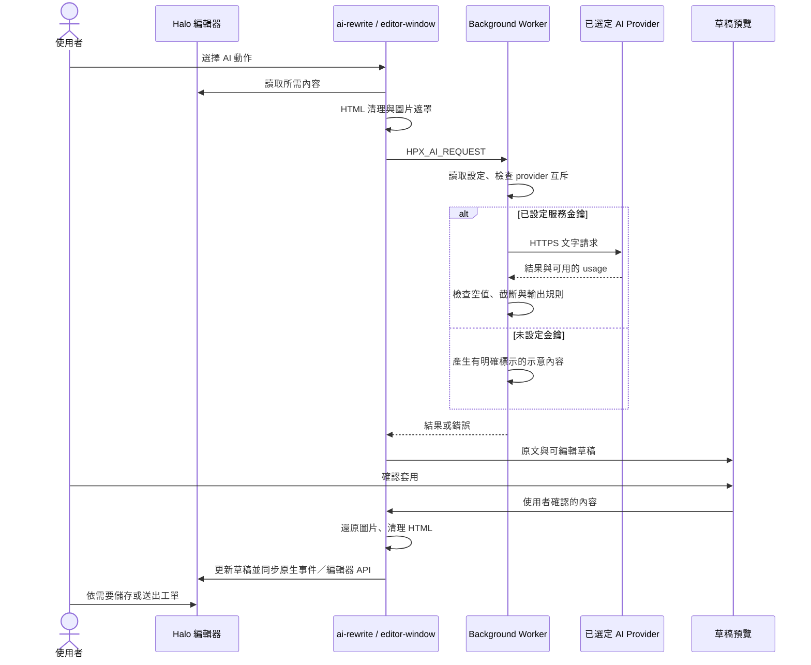

# Halo Companion 架構

Halo Companion 1.1.2 是以原生 JavaScript 撰寫的 Manifest V3 擴充功能。頁面層採 IIFE 模組與 `window.__HPX` 命名空間，背景層採 classic service worker，沒有前端框架、npm runtime 相依或編譯步驟。

## 執行環境與模組

| 環境／路徑 | 責任 | 主要整合介面 |
| --- | --- | --- |
| `src/ultimate-mode/bootstrap.js` | 在 `document_start` 建立簡單模式的早期狀態 | Halo DOM、樣式 |
| `src/core/`、`src/config/` | 命名空間、選擇器、編輯器偵測與讀寫、HTML 清理、圖片遮罩 | `window.__HPX.core`／`.config` |
| `src/features/` | AI 潤稿、範本、聯絡人、獨立編輯、閱讀器與工時調整 | core、UI、訊息與 bridge |
| `src/ui/`、`src/styles/` | 工具列、預覽、主題、設定面板、分類選擇器與寵物 | DOM、CSS、`storage.local` |
| `src/ultimate-mode/` | 可逆地精簡 Halo UI、Team 顯示與 SPA 重建處理 | 區塊模組與 observer |
| `src/page/` | `MAIN` world 的編輯器與工時橋接 | DOM 標記、CustomEvent、頁面原生 API |
| `src/background/service-worker.js` | AI 路由、設定讀取、視窗與編輯工作階段、訊息轉送 | `chrome.runtime`、`tabs`、`windows`、`storage` |
| `src/ai/` | Provider 設定、統一請求介面、prompt 與輸出驗證 | `HPX_AI_REQUEST`、`importScripts()` |
| `src/options/`、`src/onboarding/` | 設定中心、備份移轉與初始導覽 | 擴充功能頁面及背景訊息 |
| `src/editor-window/` | 獨立富文字撰寫視窗 | 背景 session、來源分頁寫回 |

## 載入順序

`manifest.json` 是載入順序的唯一宣告來源。不要任意排序其中的 JavaScript 清單。

1. `document_start` 載入簡單模式 bootstrap 與早期樣式。
2. `document_idle` 的 `MAIN` world 載入 `timesheet-bridge.js` 和 `editor-probe-bridge.js`。
3. `document_idle` 的隔離環境從 `core/namespace.js` 建立 `window.__HPX`。
4. 依序載入 config → core／AI adapter → 基礎 UI → features → 工具列／簡單模式 → 設定／導覽 → detectors。
5. 最後的 `src/content.js` 啟動各功能、掛載工具列並處理 SPA 中的新增／移除。

`window.__HPX` 包含 `config`、`core`、`ai`、`features`、`services`、`halo`、`ui`。它位於 content script 的隔離環境，不等同頁面的 `window` 全域；需要存取 Halo 編輯器實例時透過 `MAIN` bridge 溝通。

背景服務以 `importScripts()` 同步載入 `provider-settings.js`、`prompt-templates.js`、`output-validator.js`。擴充功能設定頁與獨立編輯頁有自己的 HTML script 清單，也需要維持相依順序。

## AI 草稿資料流

API Key 從擴充功能本機設定讀取，用於背景服務的 HTTP 認證標頭，不放入頁面 bridge。圖片內容與圖片 URL 以遮罩保留；文字中的工單資訊仍會送至使用者選定的 AI 服務。Provider 失敗時不自動切換至另一家服務。

Azure 使用部署的 chat completions 端點。Ornith 使用 `/v1/chat/completions`，並要求必要的 thinking 控制；不支援時停止請求。Ornith URL 必須為 HTTPS、路徑為 `/v1`，且與 manifest 中明確授權的單一 origin 相同。

## 原生寫入邊界

### 編輯器

`editor-adapter.js` 將 textarea、同源 iframe 與 contenteditable 統一成讀取、覆寫與插入介面。原生 setter 搭配 `input`、`change`、`keyup` 事件同步表單狀態；需要時透過編輯器 bridge 呼叫 Froala、CKEditor 或 TinyMCE 的 API。

獨立編輯視窗透過背景訊息取得 session，套用時由背景服務轉送至原分頁。`note-window.js` 檢查工作階段、來源編輯器是否仍存在，以及開啟後原文是否改變。成功寫回草稿後，使用者仍需操作 Halo 儲存／送出。

### 工時

| 操作 | 寫入行為 |
| --- | --- |
| Time Taken 快捷調整 | 修改原生時、分等可編輯欄位並送出原生事件；唯讀秒數由 Halo 計時器控制。擴充功能不點擊 Action 的儲存／送出。 |
| Timesheet 套用 | 經 `hpx:timesheet:move` 事件，優先呼叫頁面 `onEventDrop`，再以原生 `moveEvent()` 介面作相容處理；可能由 Halo 直接保存工時。 |

Timesheet bridge 使用目標標記、原時間標籤與內容指紋定位紀錄，再由 Halo 的 React 元件及其原生處理器更新。這是對既有頁面的整合，Halo 改版後需要重新驗證；擴充功能沒有另外維護 Halo API token。

## 資料生命週期

| 存放位置 | 資料 | 生命週期 |
| --- | --- | --- |
| `chrome.storage.local` | `hpx_settings` 中的 provider、金鑰、偏好、Team、收件人與快捷設定；最近 Halo 來源資訊 | 同一擴充功能安裝的本機持久資料 |
| `chrome.storage.session` | `hpx_note_session` 的 session ID、來源分頁、視窗與編輯 HTML | 瀏覽器工作階段；關閉或清除 session 後失效 |
| 頁面／閱讀視窗記憶體 | 正在顯示的 DOM、原始內容、圖片對照及閱讀快照 | 分頁／視窗生命週期 |
| 使用者下載的 JSON | 設定備份，依選項含或不含金鑰 | 使用者自行保存與移轉 |

`storage.local` 是瀏覽器提供的擴充功能儲存，程式沒有另外對金鑰加密。JSON 備份即使排除金鑰，也可能保留私人網址、電子郵件與其他個人設定。它不是工單資料庫備份。

## 測試分層

Node 原生測試 runner 驗證 provider 路由、輸出保護、備份匯入、DOM 偵測與介面不變量。瀏覽器 HTML fixtures 執行真實 DOM／CSS 行為；部分 Node 測試會以已安裝的 Chrome 或 Edge 啟動這些 fixtures。預覽以示範資料與獨立 storage 模擬運行，不代表已驗證所有 Halo 租戶的真實環境。
