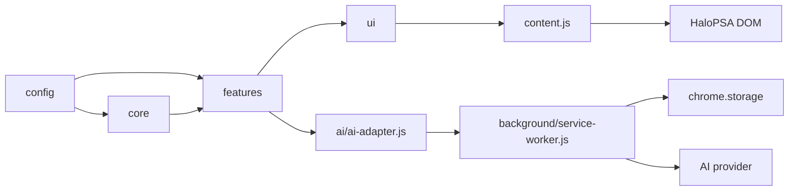

# 架構文件

## Runtime 分層

所有注入頁面的 JavaScript 都是 IIFE。`src/core/namespace.js` 先建立 `window.__HPX`，後續模組在這個物件下以 `config`、`core`、`features`、`ui` 與 `ai` 分類註冊。`manifest.json` 的陣列順序因此不可任意變動。

## 模組責任與依賴

| 模組 | 依賴 | 產出／責任 |
| --- | --- | --- |
| `page/*-bridge.js` | HaloPSA 頁面世界 | 在需要 page-world 存取時提供 bridge。 |
| `core/editor-detector.js`、`email-window-detector.js` | selector 設定 | 觀察 SPA DOM，回報可掛載的目標。 |
| `core/editor-adapter.js` | DOM | 統一讀取、寫入與通知各型態 editor。 |
| `core/html-*`、`image-placeholder.js` | DOM／HTML | 清理不安全 HTML、保留可比對內容、處理圖片。 |
| `features/*` | config、core、ui | 實作使用者功能與流程邊界。 |
| `ui/*` | features、core | 掛載工具列、呈現結果與設定。 |
| `ai/ai-adapter.js` | `chrome.runtime` | 將 AI 請求轉給背景，不讀取金鑰。 |
| `background/service-worker.js` | storage、AI provider | 讀取本機設定、執行 API 呼叫、管理 Note session。 |
| `editor-window/*` | core、features、ui | 在 Extension 特權頁面編輯單一 Note session。 |
| `pets/*`、`core/pet-registry.js` | web-accessible resources | 發現與播放可選擇的 Pet 素材。 |

## 關鍵資料流

### AI 改寫

`toolbar/editor-window` → `features/ai-rewrite` → `ai/ai-adapter` → `HPX_AI_REQUEST` → `service-worker` → AI provider → 預覽 modal → `editor-adapter`。

API key 只由 Options page 寫入本機 extension storage，並由 Service Worker 讀取；它不會進入 HaloPSA 的 page context。

### Activity Note

`features/note-window` 先從 editor 取出並清理 HTML，將 session payload 交給 Service Worker。Service Worker 建立 popup 並把資料放在 `chrome.storage.session`；`editor-window` 取回、編輯並在使用者確認後送出 `HPX_NOTE_APPLY`。背景再將結果傳回原 tab，由 `note-window` 寫回 editor。關閉視窗、tab 或 session 後都會清除暫存。

### 本機設定

AI、外觀與聯絡人群組共用 `chrome.storage.local.hpx_settings`。所有寫入都應讀取後合併，避免一個設定區塊覆蓋另一個區塊。聯絡人資料不提供預設值，也不應寫入 repository。

## 維護準則

- 新增或調整 DOM selector，優先修改 `src/config/selectors.js` 或 `src/config/besties-config.js`。
- 新增 content script 模組時，同步更新 `manifest.json` 的載入順序和路徑。
- 保持 API 呼叫與金鑰在背景層；content script 只透過 `chrome.runtime` 傳遞工作訊息。
- 修改 editor 寫入行為後，應確認框架事件仍會觸發，並在 HaloPSA 環境人工驗證。
