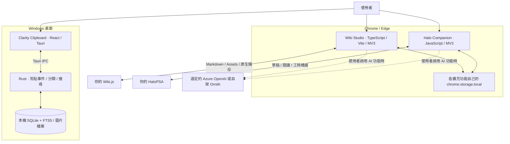

# Everyday Tools · 三個工具的架構全景

這組工具分別處理文件撰寫、服務工單與日常複製貼上。它們共用一致的作品視覺設計，各自安裝、各自執行，也各自保存設定與資料。

| 工具 | 解決的問題 | 技術 | 資料最後存在哪裡 |
| --- | --- | --- | --- |
| [Wiki Studio](https://github.com/tigerhzu/freedom-wiki-assistant) | 視覺化編輯、圖片資產與文件模板 | TypeScript、Vite、Manifest V3、Wiki.js page bridge | 文件及圖片由 Wiki.js 保存；擴充功能設定留在瀏覽器本機 |
| [Halo Companion](https://github.com/tigerhzu/halo-psa-extension) | 工單撰寫、AI 草稿、閱讀與工時操作 | 原生 JavaScript、Manifest V3、DOM adapter、page bridge | 工單由 Halo 原生流程保存；擴充功能偏好留在瀏覽器本機 |
| [Clarity Clipboard](https://github.com/tigerhzu/clarity-clipboard) | 搜尋剪貼歷史、分類與重用個人片段 | React、TypeScript、Tauri 2、Rust、SQLite FTS5 | 本機資料庫與圖片目錄 |

## 設計上的共同原則

- **沿用原本工作的儲存位置。** Wiki 仍由 Wiki.js 儲存；Halo 草稿仍交回原生介面；剪貼後台直接管理本機歷史。
- **把不同執行環境的溝通集中處理。** 兩個擴充功能以 page bridge 接觸頁面內的編輯器／框架；桌面程式以 Tauri IPC 串接前端與 Rust。
- **設定與內容的流向明確。** 兩個擴充功能的 AI 功能會把對應內容送往選定服務；未使用 AI 時，這條資料流不會執行。剪貼後台目前沒有 AI 或雲端同步功能。
- **獨立運作。** 三者沒有共用資料庫、自動互傳內容或共用背景服務。安裝其中一個不需要安裝另外兩個。

## 安裝與原始碼

| 工具 | 下載 | 架構文件 |
| --- | --- | --- |
| Wiki Studio | [最新 Release](https://github.com/tigerhzu/freedom-wiki-assistant/releases/latest) | [Wiki 架構](https://github.com/tigerhzu/freedom-wiki-assistant/blob/main/docs/ARCHITECTURE.md) |
| Halo Companion | [最新 Release](https://github.com/tigerhzu/halo-psa-extension/releases/latest) | [Halo 架構](https://github.com/tigerhzu/halo-psa-extension/blob/main/docs/ARCHITECTURE.md) |
| Clarity Clipboard | [最新 Release](https://github.com/tigerhzu/clarity-clipboard/releases/latest) | [Clarity 架構](https://github.com/tigerhzu/clarity-clipboard/blob/main/docs/ARCHITECTURE.md) |

首頁封面的 SVG 光暈與軌道動畫支援減少動態效果偏好；同時附有靜態 SVG、向量 Logo 與 PNG Logo，可從各專案的 `docs/assets/` 取得。
